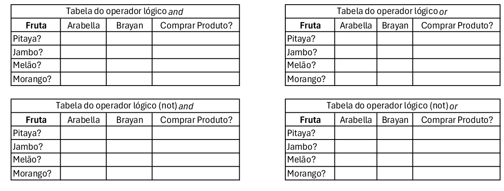

<details open>
	<summary><h2>Sumário</h2></summary>
	<nav>
    	<a href ="#atividade17-06">Atividade Segunda-feira dia 17/06/2024</a> <br>
    	<a href ="#atividade20-06">Atividade Quinta-feira dia 20/06/2024</a> <br>
		<a href ="#atividade08-07">Atividade Segunda-feira dia 08/07/2024</a> <br>
		<a href ="#atividade11-07">Atividade Quinta-feira dia 11/07/2024</a>
	</nav>
</details>

<details>
	<summary><h2 id ="atividade17-06">Atividade Segunda-feira dia 17/06/2024</h2></summary>

### 1. Acesse o site [www.sqliteonline.com](https://sqliteonline.com/). e apague o código *SELECT * FROM demo*; e adicione o seguinte código para criar uma tabela:

```sql
CREATE TABLE hospital_geral_santa_tereza
(
	cnpj TEXT,
	nome_empresarial TEXT,
	nome_fantasia TEXT,
	telefone INTEGER,
	cep TEXT,
	bairro TEXT,
	cidade TEXT,
	logradouro TEXT,
	email TEXT,
	orcamento REAL
);
```
Quantas colunas foram criadas?

Quais são os nomes das colunas?

Quais os tipos de dados nas colunas cep, cnpj e orcamento?

Quais os 3 tipos de dados diferentes na tabela?

### 3. Apague o código acima e execute o seguinte comando: *SELECT * FROM hospital_geral_santa_tereza;* para exibir todas as colunas.

Depois apague e execute o seguinte comando: *SELECT cnpj, telefone From hospital_geral_santa_tereza;*
Depois apague e execute um comando para exibir todas colunas do tipo texto;


### 4. Qual o comando para criar uma tabela?

### 5. Qual o comando para exibir todas as colunas de uma tabela?

### 6. Apague o código acima e execute o seguinte código:

```sql
INSERT INTO hospital_geral_santa_tereza (cnpj, nome_empresarial, nome_fantasia, telefone, cep, bairro, cidade, logradouro, email, orcamento)

VALUES ('15.194.004/0018-73','FUNDACAO JOSE SILVEIRA','HOSPITAL GERAL SANTA TEREZA',7135045713, '48400-000','Centro','Ribeira do Pombal','prédio','IVON.BARBOSA@FJS.ORG.BR', 45060812);
```

**Os valores (VALUES) foram adicionados conforme a ordem das colunas criadas**.

Apague o código acima e adicione o seguinte código para exibir todas as colunas:
*SELECT * FROM hospital_geral_santa_tereza;*

### 7. Crie uma tabela com o nome estudante_cetep com 4 colunas: cpf, matrícula, data_nascimento e nome. Cada coluna deve ter seu tipo de dado.

### 8. Agora, adicione valores para o novo estudante: cpf, matrícula, data de nascimento e nome. Depois adicione o comando para exibir todas as colunas da tabela;

</details>

<details>
	<summary><h2 id ="atividade20-06">Atividade Quinta-feira dia 20/06/2024</h2></summary>

### Utilize o pydroid3 ou acesse [www.online-python.com](https://www.online-python.com/)

### Parte 1

### 1. Categorize os operadores em Python como relacional, lógico, atribuição ou matemático.

*Copie as respostas no caderno*

a. **!=** _________________ <br>
b. **==**_________________ <br>
c. **//**__________________ <br>
d. **>**__________________ <br>
e. **/**__________________ <br>
f. **>=**_________________ <br>
g. **%**_________________ <br>
h. * _________________ <br>
i. **+**__________________ <br>
j. **<=**_________________ <br>
k. **_________________ <br>
l. **-**__________________ <br>
m. **and**_______________ <br>
n. **or**_________________ <br>
o. **not**________________ <br>
p. **=**__________________ <br>

### 2. Analise aonde estão os erros e reescreva no caderno.
a.
```python
if variável0 == variável2:
    print(False)
    
else:
    
    print(true)
  
else
    print(OK")
```

### 3. Sintaxe para utilização de marcadores e assim exibir automaticamente o conteúdo da variável:



#### Escreva o programa abaixo em um editor Python e execute para ver o resultado:**
```python
variável0, variável2, variável3 = 4, "Olá", 5.5

if True != False:
    
    print("O valor %s é diferente do valor %d" % (variável2, variável0))
    
    print("O valor %.2f é diferente ddo valor %s" % (variável3, variável2))

    print("O valor %d é diferente do valor %.2f" % (variável0, variável3))
    
else:
    
    print("Erro fatal")
```

#### **Dicas:**

Utilize %.2f para exibir números decimais não tão grandes.<br>
Coloque o sinal de % antes de especificar quais as variáveis que estarão entre parênteses

<br>

### 4. Faça o seguinte programa utilzando marcadores:

Roberto ganha R$ 2500,00 e terá um aumento de 15%. Utilize no máximo quatro variáveis. <br>
Use print para exibir o salário depois do aumento e o valor do aumento <br>
Fórmula 1 para porcentagem: (valorbase / 100) × porcentagem <br>
Fórmula 2 para porcentagem: (valorbase * porcentagem) / 100

<br>

### Parte 2

### 5. Resolver as tabelas abaixo no caderno.

##### Lembre-se que 5 > 2 and 2 > 3 é uma afirmação falsa <br>

##### Lembre-se que 5 > 2 or 2 > 3 é uma afirmação verdadeira <br>

##### Lembre-se que o operador not inverte o resultado

##### Preencha a tabela com sim e não nos devidos lugares.


### 6. Faça o seguinte programa também utilizando marcadores:

A Le biscuit está com um promoção de 10% para produtos abaixo de R$100,00 e 7% para produtos acima de R$100,00.<br>
Tenha uma variável com valor maior ou igual a 100 e outra menor que 100.<br>
Use o print para exibir o valor com desconto e o valor do desconto.

<br>

### Conteúdo Opcional:

#### 1. Faça o seguinte programa também utilizando marcadores:
Quanto tempo levaria para percorrer o trecho São Paulo Dubai? <br>
A distância é de 7687 milhas e a velocidade média do avião é 1078 km/h <br>
Não esqueça de converter milhas para quilômetros

</details>

<details>
	<summary><h2 id ="atividade08-07">Atividade Segunda-feira dia 08/07/2024</h2></summary>
	
### 1. Acesse o site [www.sqliteonline.com](https://sqliteonline.com/) apague o código *SELECT * FROM demo*; e adicione o seguinte código para criar uma tabela:

```sql
CREATE TABLE estudante_cetep
(
    cpf TEXT,
    matricula INTEGER,
    data_nascimento TEXT,
    nome TEXT,
    email TEXT,
    nte INTEGER,
    municipio TEXT,
    escola TEXT,
    codigo_sec INTEGER,
    oferta_ensino TEXT,
    ano_serie INTEGER,
    turma TEXT
);
```

### 2. Depois de criar a tabela, use o comando SELECT * FROM estudante_cetep para exibir todas as conlunas da tabela;

### 3. Apague o comando anterior e use o seguinte comando para adicionar valores dentro da tabela:

```sql
INSERT INTO estudante_cetep ()
VALUES ();
```

_Dentro do primeiro parêntese adicione o nome das colunas separados por vírgula e na ordem criada_ <br>
_Dentro do segundo parêntese adcione os valores das colunas separados por vírgula e na ordem criada. Se for texto, coloque aspas simples._

### 4. Classifique abaixo como sendo um dado do tipo TEXT, REAL ou INTEGER:

a. Nome:

- [ ] TEXT
- [ ] REAL
- [ ] INTEGER

b. email:

- [ ] TEXT
- [ ] REAL
- [ ] INTEGER

c. data_nascimento:

- [ ] TEXT
- [ ] REAL
- [ ] INTEGER

d. salario:

- [ ] TEXT
- [ ] REAL
- [ ] INTEGER

e. telefone:

- [ ] TEXT
- [ ] REAL
- [ ] INTEGER

f. peso:

- [ ] TEXT
- [ ] REAL
- [ ] INTEGER
      
g. idade:

- [ ] TEXT
- [ ] REAL
- [ ] INTEGER

h. 5.5:

- [ ] TEXT
- [ ] REAL
- [ ] INTEGER

i. 'nome':

- [ ] TEXT
- [ ] REAL
- [ ] INTEGER

j. 25000:

- [ ] TEXT
- [ ] REAL
- [ ] INTEGER

### 5. Crie uma tabela pessoa que possua as seguintes características: nome, cpf, altura, idade, peso, data_nascimento.

### 6. Depois de criada a tabela, use o comando _INSERT INTO () VALUES();_ para inserir dados de uma pessoa. Não se esqueça da ordem e da quantidade dos valores dentro dos parênteses.

### 7. Depois disso, apague o conteúdo dos parênteses para poder inserir os dados de uma segunda pessoa.

### 8. Por fim, use o comando para exibir todas as colunas da tabela.
      
</details>

<details>
	<summary><h2 id ="atividade11-07">Atividade Quinta-feira dia 11/07/2024</h2></summary>
</details>
