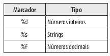
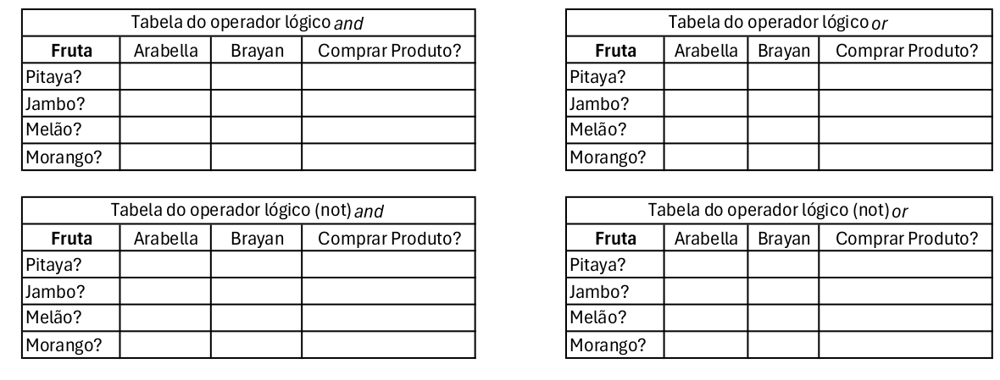

<details open>
	<summary><h2>Sumário das Atividades</h2></summary>
	<nav>
    	<h5>
			<a href ="#atividade17-06">Atividade Segunda-feira dia 17/06/2024</a>
		</h5>
    	<h5>
			<a href ="#atividade18-06">Atividade Terça-feira dia 18/06/2024</a>
		</h5>
    	<h5>
			<a href ="#atividade20-06">Atividade Quinta-feira dia 20/06/2024</a>
		</h5>
		<h5>
			<a href ="#atividade08-07">Atividade Segunda-feira dia 08/07/2024</a>
		</h5>
		<h5>
			<a href ="#atividade09-07">Atividade Terça-feira dia 09/07/2024</a>
		</h5>
		<h5>
			<a href ="#atividade11-07">Atividade Quinta-feira dia 11/07/2024</a>
		</h5>
	</nav>
</details>

<details>
	<summary><h3 id ="atividade17-06">Atividade Segunda-feira dia 17/06/2024</h3></summary>

### 1. Relacionar tags com afirmação:

- Tem a única função de definir qual o título da página. _________<br>
- Criar títulos ou subtítulos de parágrafos.__________<br>
- Criar um parágrafo.___________<br>
- Quebra de página.____________<br>
- Dar destace no texto, nesse caso, em negrito.____________<br>
- Sobrescrever uma porção de texto._____________<br>
- Sobscrever uma porção de texto.____________<br>
- Destacar um porção importante do texto._____________<br>
- Dar ênfase no texto para leitores de tela.____________<br>
- Texto em destaque equivalente a marcadores.___________<br>
- Tornar o texto itálico.___________<br>
- Tornar o texto pequeno.__________<br>

<br>

#### Assinale OK para cada uma concluída*

#### Utilize o github.com ou seu editor preferido para continuar

### 2. Crie uma segunda página e conecte a principal com essa segunda utilizando tag a. Somente letras minúscula e o final .html

### 3. Utilize tag iframe para conectar sua página com um vídeo no youtube.

### 4. Utilize tag img para adicionar uma imagem a página principal.

### 5. Crie um arquivo style.css

### 6. Adicione a tag *link* dentro da tag head na página principal para conectar o arquivo style.css

### 7 Adicione o seguinte código a seu arquivo css:

```css
a:link 
{
    color: black;
    text-decoration: none;
}

a:visited
{
    color: hotpink;
    text-decoration: none;
}

a:hover
{
    color: magenta;
    text-decoration: none;

a:active
{    
    color: cyan;
    text-decoration: none;
}
```
#### Há quatro tipos de estados de um link:

##### **a:link** - comportamento do link que não foi visitado.
##### **a:visited** - comportamento do link depois de ser clicado.
##### **a:hover** - comportamento do link quando o mouse sobrepõe o link.
##### **a:active** - comportamento do link no exato momento que é clicado.

### 8 Responda abaixo antes de modificar os 4 estados:

##### a. O que acontece quando clica no link?

##### b. O que acontece sem clicar no link?

##### c. O que acontece depois que clicar no link e voltar?

##### d. O que acontece quando o ponteiro do mouse passa sobre o link?

</details>

<details>
	<summary><h3 id ="atividade18-06">Atividade Terça-feira dia 18/06/2024</h3></summary>
	
### Parte 1

### 1. Categorize os operadores em Python como relacional, lógico, atribuição ou matemático.

*Copie as respostas no caderno*

a. **!=** _________________ <br>
b. **==**_________________ <br>
c. **//**__________________ <br>
d. **>**__________________ <br>
e. **/**__________________ <br>
f. **>=**_________________ <br>
g. **%**_________________ <br>
h. * _________________ <br>
i. **+**__________________ <br>
j. **<=**_________________ <br>
k. **_________________ <br>
l. **-**__________________ <br>
m. **and**_______________ <br>
n. **or**_________________ <br>
o. **not**________________ <br>
p. **=**__________________ <br>

### 2. Analise aonde estão os erros e reescreva no caderno.
a.
```python
1 if variável0 == variável2:
2    print(False)
3    
4 else:
5    
6    print(true)
7    
8 else
9    print(OK")
```

### 3. Sintaxe para utilização de marcadores e assim exibir automaticamente o conteúdo da variável:



#### Escreva o programa abaixo em um editor Python e execute para ver o resultado:**
```python
variável0, variável2, variável3 = 4, "Olá", 5.5

if True != False:
    
    print("O valor %s é diferente do valor %d" % (variável2, variável0))
    
    print("O valor %.2f é diferente ddo valor %s" % (variável3, variável2))

    print("O valor %d é diferente do valor %.2f" % (variável0, variável3))
    
else:
    
    print("Erro fatal")
```

#### **Dicas:**

Utilize %.2f para exibir números decimais não tão grandes.<br>
Coloque o sinal de % antes de especificar quais as variáveis que estarão entre parênteses

<br>

### 4. Faça o seguinte programa utilzando marcadores:

Roberto ganha R$ 2500,00 e terá um aumento de 15%. Utilize no máximo quatro variáveis. <br>
Use print para exibir o salário depois do aumento e o valor do aumento <br>
Fórmula 1 para porcentagem: (valorbase / 100) × porcentagem <br>
Fórmula 2 para porcentagem: (valorbase * porcentagem) / 100

<br>

### Parte 2

### 5. Resolver as tabelas abaixo no caderno.

##### Lembre-se que 5 > 2 and 2 > 3 é uma afirmação falsa <br>

##### Lembre-se que 5 > 2 or 2 > 3 é uma afirmação verdadeira <br>

##### Lembre-se que o operador not inverte o resultado

##### Preencha a tabela com sim e não nos devidos lugares.




### 6. Faça o seguinte programa também utilizando marcadores:

A Le biscuit está com um promoção de 10% para produtos abaixo de R$100,00 e 7% para produtos acima de R$100,00.<br>
Tenha uma variável com valor maior ou igual a 100 e outra menor que 100.<br>
Use o print para exibir o valor com desconto e o valor do desconto.

<br>

### Conteúdo Opcional:

#### 1. Faça o seguinte programa também utilizando marcadores:
Quanto tempo levaria para percorrer o trecho São Paulo Dubai? <br>
A distância é de 7687 milhas e a velocidade média do avião é 1078 km/h <br>
Não esqueça de converter milhas para quilômetros

</details>

<details>
	<summary><h3 id ="atividade20-06">Atividade Quinta-feira dia 20/06/2024</h3></summary>

### Sistema LN (Linguagem Natural): Conversão de texto em código e vice-versa

### Todo código Python precisa que declare as variáveis antes usá-las

```python
a = 0
b = 1

print(a + b)
```

#### A interpretação do código acima em Linguagem Natural:

A variável *a* apaga o valor anterior e recebe o valor *0* <br>
A variável *b* apaga o valor anterior e recebe o valor *1* <br>

Imprimir a seguinte expressão(*a adição b*)

<br>

### 1. Complete abaixo em Linguagem Natural:


a. 
```python
milhas = 100
quilometros = milhas * 1.6

print(quilometros)
```

A variável *milhas* apaga o valor anterior e recebe o valor  ______ <br>
A variável ______________ apaga o valor anterior e recebe o valor *milhas* multiplicação ____ <br>

_________ a seguinte expressão(quilometros)

b.

```python
metros = 1
centimetros = metro * 100

print(centimetros)
```
A variável _________ apaga o valor anterior e recebe o valor _____ <br>
A variável _centimetros_ apaga o valor anterior e recebe metros _____________ 100

__________________________________(centimetros)

<br>

### 2. Converter o seguinte código Python em Linguagem Natural:

```python
distancia = 1000
velocidadeMedia = 150

print(distancia / velocidadeMedia)
```

<br>

### 3. Converter o seguinte texto para Python:

A variável *salário* apaga o valor anterior e recebe o valor *2500*<br>
A variável *aumento* apaga o valor anterior e recebe o valor 375

Imprimir a seguinte expressão(salário adição aumento)

<br>

### 4. Modificando os valores das variáveis:

```python
a = 0
b = 1
a += 1
b -= 1

print(a + b)
```

#### A interpretação do código Python acima em Linguagem Natural:

A variável *a* apaga o valor anterior e recebe o valor *0*<br>
A variável *b* apaga o valor anterior e recebe o valor *1*<br>
A variável *a* acrescenta 1 ao valor anterior<br>
A variável *b* subtrai 1 ao valor anterior<br>

Imprimir a seguinte expressão(*a adição b*)

#### a. Converter o seguinte código em Python para Linguagem Natural:

```python
distancia = 1000
velocidadeMedia = 150
distancia -= 100
velocidadeMedia += 50

print(distancia / velocidadeMedia)
```

#### b. Converter o seguinte código em Python para Linguagem Natural:

```python
dias = 365
meses = dias / 28
```

</details>

<details>
	<summary><h3 id ="atividade08-07">Atividade Segunda-feira dia 08/07/2024</h3></summary>

 ### 1. Tag ul e tag li para criação de lista não ordenada:

```html
<ul>
	<li>Primeiro tópico da lista não ordenada</li>
	<li>Segundo tópico da lista não ordenada</li>
</ul>
```

Criar uma lista não ordenada como os seguintes tópicos:

HTML, CSS, JavaScript, Web design, UI, UX, WWW, desenvolvimento.

<br>

### 2. Aninhar tags dentro da outra para criar listas dentro de listas:

```html
<ul>

    <li>Primeiro tópico da lista não ordenada</li>
    <li>Segundo tópico da lista não ordenada</li>

    <ul>
        <li>Primeiro subtópico</li>
        <li>Segundo subtópico</li>
    </ul>

    <li>Terceiro tópico da lista não ordenada</li>

</ul>
```

### Criar uma lista não ordenada com a seguinte estrutura e conteúdo:

- Tags de formatação
    -    b
    -    p
    -    em
    -    i
    -    strong
    -    br
    -    h1 até h6
    -    mark
    -    small
    -    sub
    -    sup
- Tags de multimídia
    - figure
    - img
    - figcaption
    - video
    - iframe
    - audio
- Tag de navegação
    - nav
    - a

### Quais tags são usadas em conjunto para criar uma lista não ordenada?

- [ ] lu, il
- [ ] ul, li
- [ ] li, lu
- [ ] il, ul

<br>

### 3. Tag ol e tag li para criação de lista ordenada:

```html
<ol>
    <li>Primeiro tópico da lista ordenada</li>
    <li>Segundo tópico da lista ordenada</li>
</ol>
```

### Criar uma lista ordenada contendo as versões para usuário do Windows, começando do XP em diante até o Windows 11

<br>

### 4. Assim como na lista não ordenada, também é possível aninhas listas ordenadas.

```html
<ol>
    <li>Primeiro tópico</li>
    <li>Segundo tópico</li>
   
     <ol>
       
        <li>Primeiro subtópico</li>
        <li>Segundo subtópico</li>
    </ol>

    <li>Terceiro tópico</li>

</ol>
```

### Criar uma lista ordenada com a seguinte estrutura e conteúdo:

1. Windows XP
2. Windows Vista
3. Windows 7
4. Windows 8
5. Windows 8.1
6. Windows 10
    1. 1507
    2. 1511
    3. 1607
    4. 1703
    5. 1709
    6. 1803
    7. 1903
    8. 1909
    9. 2004
    10. 20H2
    11. 21H1
    12. 21H2
    13. 22H2
7. Windows 11
    1. 21H2
    2. 22H2
    3. 23H2
  
### Quais tags são usadas em conjunto para criar uma lista ordenada?

- [ ] lu, li
- [ ] ul, li
- [ ] ol, li
- [ ] ol, il

<br>

Adicione o seguinte código ao arquivo html:

```html
<!DOCTYPE html>

<html lang ="pt-br">
   
<head>
   
    <meta charset = "utf-8">

    <meta name ="viewport" content ="width=device-width,initial-scale=1"/>
       
    <title></title>

    <link rel ="stylesheet" type ="text/css" href ="style.css">
   
</head>

<body>

    <h1>Um resumo de alguns elementos</h1>

    <p>Um elemento parágrafo irá conter majoritariamente texto. Por agora, é importante saber que você não pode aninhar um parágrafo dentro do outro.</p>

    <p>O elemento <code>ol</code> (<i>ordered list</i>) representa uma lista de items onde os items foram intencionalmente ordenados. O elemento <code>li</code> representa um item dessa lista.</p>

    <p>O elemento <code>ol</code> (<i>ordered list</i>) representa uma lista de items onde os items foram intencionalmente ordenados. O elemento <code>li</code> representa um item da lista.</p>

    <figure>
                   
         <br>
                   
         <figcaption>Tirinha dos números primos</figcaption>
                    
    </figure>
     
</body>
 
</html>
```

Ao arquivo css, adicione os seguintes seletores simples:

```css
h1{
    font-family: Garamond;
    font-size: 5vw;
}

i{
    font-family: Helvetica;
}

code{
    color: cyan;
}

p{
    font-size: 3vw;
}

img{
    filter: grayscale(100%);
}
```
Observe que cada seletor representa uma tag

### Opcionais: ddicione as seguintes propriedades em cada uma das tags você possua em sua página:**

font-size: 2vw;  // Tamanho da fonte conforme largura da página. Nesse caso, 2vw é 2% da largura

color: khaki;    // Cor

font-family: Verdana;   // Altera a fonte. Teste também com Courier New, Garamond, Arial eMonaco

font-variant-caps: petite-caps;   // Fonte em caxa-alta

text-align: justify   // teste também com as opções center, left e right no lugar de justify

</details>

<details>
	<summary><h3 id ="atividade09-07">Atividade Terça-feira dia 09/07/2024</h3></summary>
 
</details>

<details>
	<summary><h3 id ="atividade11-07">Atividade Quinta-feira dia 11/07/2024</h3></summary>
 
</details>
